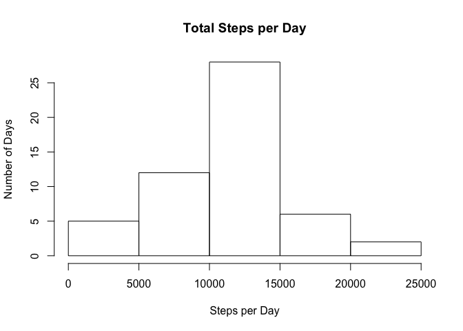
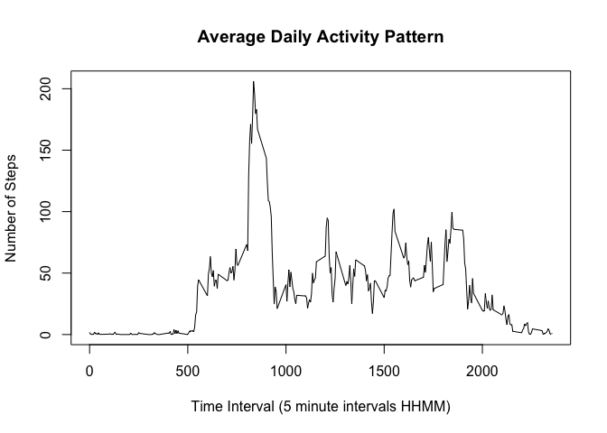
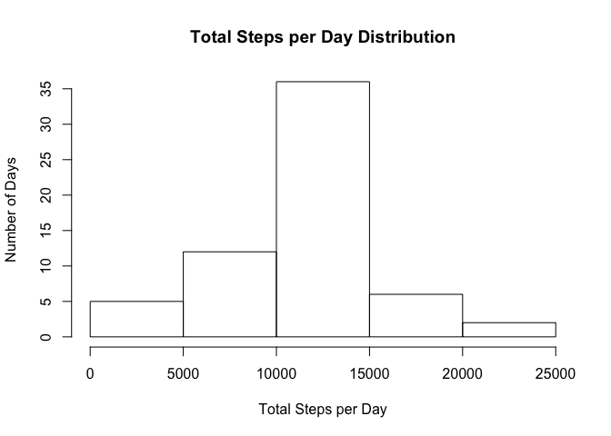
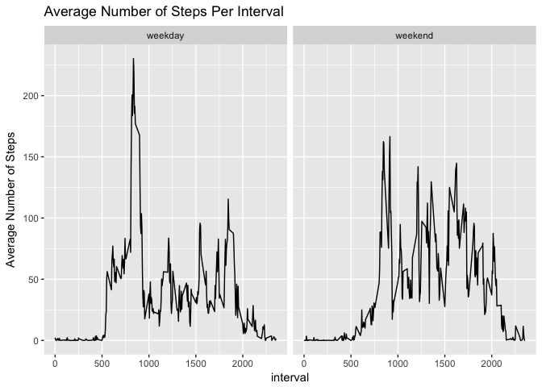

# Reproducible Research: Peer Assessment 1


## Load the R packages that are used later on

```r
library(dplyr)
library(ggplot2)

ads <- read.csv("activity.csv")
```


## What is the mean total number of steps taken per day?
First calculate the total steps per day and display using a histogram

```r
totalStepsByDay <- ads %>% 
                    filter(complete.cases(ads) == TRUE) %>%
                    group_by(date) %>% 
                    summarize(TotalSteps = sum(steps))
hist(totalStepsByDay$TotalSteps, xlab = "Steps per Day", ylab = "Number of Days", 
     main = "Total Steps per Day")
```

<!-- -->

Next calculate the mean and median


```r
mean(totalStepsByDay$TotalSteps)
```

```
## [1] 10766.19
```

```r
median(totalStepsByDay$TotalSteps)
```

```
## [1] 10765
```


## What is the average daily activity pattern?

```r
averageStepsPerInterval <- ads %>%
                            filter(complete.cases(ads) == TRUE) %>%
                            group_by(interval) %>%
                            summarize(AverageNumberSteps = mean(steps))
with(averageStepsPerInterval, plot(interval, AverageNumberSteps, type = "l", 
                                  xlab = "Time Interval (5 minute intervals HHMM)", 
                                  ylab = "Number of Steps", 
                                  main = "Average Daily Activity Pattern"))
```

<!-- -->

Which 5 minute interval, on average across all days, contains the max number of steps?

```r
maxIndex <- which.max(averageStepsPerInterval$AverageNumberSteps)
averageStepsPerInterval$interval[maxIndex]
```

```
## [1] 835
```


## Imputing missing values
How many missing values are there?

```r
nrow(filter(ads,complete.cases(ads) == FALSE))
```

```
## [1] 2304
```

Devise a strategy for filling in all the missing values (i.e., NAs) in the **ads** dataset.  
Use the interval mean to fill in for the missing values (i.e., NAs). 

```r
# The dataset with the missing values filled in
cads <- mutate(ads, csteps = ifelse(is.na(steps), 
                rep(averageStepsPerInterval$AverageNumberSteps, length(unique(ads$date))), 
                steps))
# Make a histogram of the total number of steps taken each day
cTotalStepsByDay <- cads %>%
    group_by(date) %>% 
    summarize(TotalSteps = sum(csteps))
hist(cTotalStepsByDay$TotalSteps, xlab = "Total Steps per Day", ylab = "Number of Days", 
     main = "Total Steps per Day Distribution")
```

<!-- -->

Calculate and report the mean and median total number of steps per day using the **cads** dataset, which has imputed values for previously missing value.


```r
mean(cTotalStepsByDay$TotalSteps)
```

```
## [1] 10766.19
```

```r
median(cTotalStepsByDay$TotalSteps)
```

```
## [1] 10766.19
```

The median of the imputed value dataset **cads** now equals the mean of the original **ads** dataset, which is to be expected since mean values were used to fill in for missing values. The mean remains the same, as expected.

## Are there differences in activity patterns between weekdays and weekends?

```r
wd <- weekdays(strptime(as.character(cads$date), "%Y-%m-%d"))
# Create a new factor variable "dayType"" with two levels - "weekday" and "weekend"
cads$dayType <- as.factor(ifelse(wd == "Saturday" | wd == "Sunday", "weekend", "weekday"))

cAverageStepsPerInterval <- cads    %>%    
                            group_by(dayType, interval) %>%
                            summarize(AverageNumberSteps = mean(csteps))
# Make a two panel plot, separating weekday values from weekend values
p <- ggplot(cAverageStepsPerInterval) +
        geom_line(mapping = aes(x = interval, y = AverageNumberSteps)) +
        facet_wrap(~ dayType, nrow = 1) +
        ggtitle("Average Number of Steps Per Interval") + ylab("Average Number of Steps")
print(p)
```

<!-- -->

From the above plot it is clear that there are differences between weekday and weekend activity.
